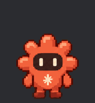

# Mascotte Claude



Une petite mascotte de bureau pour Claude : elle vit en bas à droite de l'écran, respire, cligne des yeux, se balade, et réagit à ce que fait Claude Code. L'idée vient de la mascotte animée de Codex : Claude méritait la sienne.

*A small desktop companion for Claude, inspired by the Codex pets: it sits in the corner of the screen, idles, walks around, and reflects what Claude Code is doing (working, waiting for you, done, failed). Windows, single exe, no install.*

> **Projet de fan, non officiel.** Il n'est ni créé ni approuvé par Anthropic. « Claude » est une marque d'Anthropic.

## Ce qu'elle fait

- **Elle vit sa vie** : respiration, clins d'œil, petits saluts, sauts et balades le long du bas de l'écran.
- **Survol** : une pilule apparaît sous elle, avec un bouton *nouvelle conversation avec Claude* et un bouton *menu*.
- **Clic** : elle salue (et saute une fois sur trois). **Glisser** : elle court dans le sens où on la tire et garde sa nouvelle place.
- **Clic droit** : animations, taille (petite à très grande), balade, premier plan, lancement au démarrage de Windows, quitter.
- **Elle suit Claude Code** : on peut lui envoyer un état, elle change d'animation et le dit dans une bulle.

| État envoyé | Ce qu'elle fait | Bulle par défaut |
| --- | --- | --- |
| `running` | tape sur son ordinateur, en boucle | Je m'en occupe… |
| `waiting` | lève la main, en boucle | J'ai besoin de toi ! |
| `review` | vérifie puis salue | C'est prêt ! |
| `failed` | s'affaisse, les yeux en croix | Aïe, ça a coincé… |
| `idle` | retour au repos | |
| `waving`, `jumping`, `walking` | un salut, un saut, une balade | |

```
MascotteClaude.exe --etat running
MascotteClaude.exe --etat waiting "Je peux lancer les tests ?"
```

Le texte après l'état remplace la bulle par défaut.

## Installer

Télécharger `MascotteClaude.exe` dans les [Releases](../../releases) et le lancer. Windows 10 ou 11, rien d'autre à installer.

## La brancher sur Claude Code

Avec ces *hooks* dans `~/.claude/settings.json`, la mascotte suit toute seule ce que fait Claude Code (adapter le chemin de l'exe) :

| Moment | État envoyé |
| --- | --- |
| tu envoies un message, ou un outil vient de finir | `running` |
| Claude te pose une question ou demande une autorisation | `waiting` |
| Claude a fini de répondre | `review` |
| le tour s'arrête sur une erreur | `failed` |

```json
{
  "hooks": {
    "UserPromptSubmit": [
      { "hooks": [{ "type": "command", "command": "C:/chemin/vers/MascotteClaude.exe", "args": ["--etat", "running"], "async": true, "timeout": 10 }] }
    ],
    "PostToolUse": [
      { "hooks": [{ "type": "command", "command": "C:/chemin/vers/MascotteClaude.exe", "args": ["--etat", "running"], "async": true, "timeout": 10 }] }
    ],
    "PreToolUse": [
      { "matcher": "AskUserQuestion", "hooks": [{ "type": "command", "command": "C:/chemin/vers/MascotteClaude.exe", "args": ["--etat", "waiting"], "async": true, "timeout": 10 }] }
    ],
    "PermissionRequest": [
      { "hooks": [{ "type": "command", "command": "C:/chemin/vers/MascotteClaude.exe", "args": ["--etat", "waiting"], "async": true, "timeout": 10 }] }
    ],
    "Notification": [
      { "matcher": "permission_prompt|elicitation_dialog", "hooks": [{ "type": "command", "command": "C:/chemin/vers/MascotteClaude.exe", "args": ["--etat", "waiting"], "async": true, "timeout": 10 }] }
    ],
    "Stop": [
      { "hooks": [{ "type": "command", "command": "C:/chemin/vers/MascotteClaude.exe", "args": ["--etat", "review"], "async": true, "timeout": 10 }] }
    ],
    "StopFailure": [
      { "hooks": [{ "type": "command", "command": "C:/chemin/vers/MascotteClaude.exe", "args": ["--etat", "failed"], "async": true, "timeout": 10 }] }
    ]
  }
}
```

La forme `command` + `args` lance l'exe directement, sans passer par un shell : un chemin avec des espaces ne pose aucun problème. `async` évite de faire attendre Claude. Un état `running` répété ne relance ni la bulle ni l'animation.

## Changer son apparence

Un fichier `mascotte.png` posé à côté de l'exe remplace les images intégrées. C'est un atlas de 8 colonnes × 9 lignes, en cases de 192 × 208 pixels, fond transparent : la même disposition que les pets de Codex.

| Ligne | Animation | Images |
| ---: | --- | ---: |
| 0 | repos (respiration ×4, clin d'œil, repos) | 6 |
| 1 | marche vers la droite | 8 |
| 2 | marche vers la gauche | 8 |
| 3 | salut | 4 |
| 4 | saut | 5 |
| 5 | raté | 8 |
| 6 | attente | 6 |
| 7 | travail | 6 |
| 8 | vérification | 6 |

## Compiler

```
powershell -ExecutionPolicy Bypass -File construire.ps1
```

Le script utilise le compilateur C# livré avec Windows (.NET Framework 4). Python avec Pillow et numpy ne sert qu'à reconstruire l'atlas.

- `src/MascotteClaude.cs` : l'application (WPF, fenêtre transparente toujours visible).
- `outils/construire_atlas.py` : découpe la planche de poses, retire le fond vert, fabrique les images de respiration, de saut et de marche, puis assemble l'atlas et l'icône.
- `sources/planche-1.png` : la planche de 12 poses, générée par IA (ChatGPT) à partir d'une description du personnage.
- `assets/` : l'atlas et l'icône produits par le script.

## Licence

MIT, voir [LICENSE](LICENSE).
